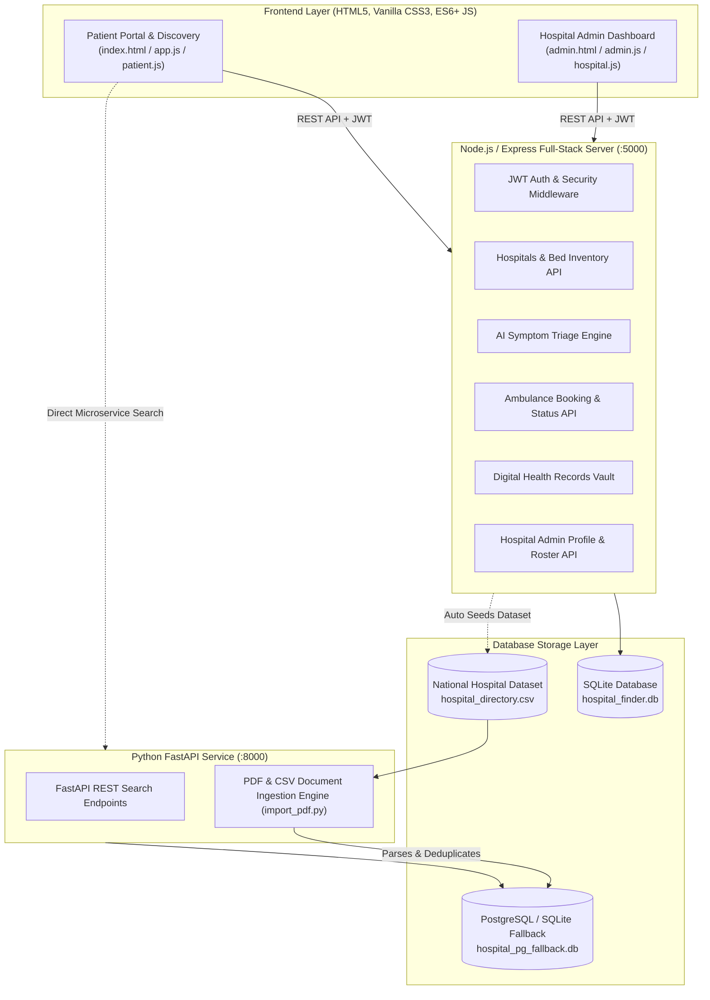

# 🏥 MediGo — Smart Hospital Finder & Healthcare Ecosystem

[](https://nodejs.org/)
[](https://expressjs.com/)
[](https://fastapi.tiangolo.com/)
[](https://python.org/)
[](https://www.sqlite.org/)
[](LICENSE)

> **MediGo** is an intelligent, full-stack healthcare discovery and hospital management platform designed to streamline emergency triage, real-time bed tracking, hospital discovery, ambulance dispatching, and digital health records management.

---

## 📌 Table of Contents

- [Overview](#-overview)
- [Key Features](#-key-features)
- [System Architecture](#-system-architecture)
- [Tech Stack](#-tech-stack)
- [Project Directory Structure](#-project-directory-structure)
- [Getting Started & Installation](#-getting-started--installation)
  - [Prerequisites](#prerequisites)
  - [1. Running the Node.js / Express Full-Stack Server](#1-running-the-nodejs--express-full-stack-server)
  - [2. Running the Python FastAPI Service (Optional / Data Pipeline)](#2-running-the-python-fastapi-service-optional--data-pipeline)
  - [3. Ingesting Hospital Data (CSV / PDF)](#3-ingesting-hospital-data-csv--pdf)
- [Default Demo Credentials](#-default-demo-credentials)
- [REST API Endpoints Reference](#-rest-api-endpoints-reference)
- [Database Schema & Data Models](#-database-schema--data-models)
- [Portals & User Flows](#-portals--user-flows)
  - [1. Patient & Discovery Portal](#1-patient--discovery-portal-indexhtml)
  - [2. Hospital Admin & Operations Dashboard](#2-hospital-admin--operations-dashboard-adminhtml)
- [License](#-license)

---

## 🌟 Overview

Finding the right medical care during emergencies or for planned treatments is often hindered by fragmented data, lack of real-time ICU/bed transparency, and unclear pricing. **MediGo** solves this by bridging the gap between patients, hospitals, and emergency responders through:

1. **Instant Geolocation & Multi-Filter Hospital Search:** Filter thousands of hospitals by state, district, sector (Government / Private), treatment budget, and active ICU beds.
2. **AI-Powered Symptom Checker & Clinical Triage:** Evaluates patient symptoms against a structured disease database and recommends the exact clinical department, urgency level, and estimated procedure costs.
3. **Live ICU & Emergency Bed Tracker:** Real-time visibility into general beds, ICU units, and emergency beds.
4. **Emergency SOS & Ambulance Dispatch System:** One-click ambulance request with dynamic fare calculation, vehicle class selection (Normal, ICU Ventilator, Govt Life Support), and live ETA updates.
5. **Patient Digital Health Vault:** Secure personal health record (PHR) storage for prescriptions, diagnostic reports, allergies, and emergency medical IDs.
6. **Hospital Partner Management Portal:** Self-service administrative dashboard for healthcare providers to manage bed counts, OPD schedules, doctor rosters, surgery packages, certifications, and hospital verification.

---

## ⚡ Key Features

### 🔍 1. Smart Search & Discovery Engine
- **Hierarchical Geo-Filtering:** Dynamically loads Indian States and District dropdowns populated directly from database records.
- **Multi-Factor Criteria:** Filter by Government vs. Private sector, budget constraints, medical specialties, and 24x7 emergency readiness.
- **Detailed Hospital Dossier:** Comprehensive modals displaying department breakdowns, doctor profiles with OPD timings and fees, transparent surgery package pricing, amenities, and direct calling.

### 🩺 2. AI Symptom Checker & Triage Assistant
- Instant natural language symptom matching against structured disease databases.
- Multi-symptom scoring algorithm ranking potential conditions with severity badges (**Low**, **Medium**, **High**, **Emergency Risk**).
- Automated routing to the appropriate medical specialist (e.g., Cardiologist, Orthopedic Surgeon, Neurologist) and cost estimation.

### 🚨 3. Emergency SOS & Ambulance Booking
- Dedicated SOS emergency workflow for urgent hospital admissions.
- Vehicle categorization with transparent per-km pricing:
  - 🚑 **Normal Ambulance** (Standard transport)
  - 🏥 **ICU Ventilator Ambulance** (Advanced life support with medical staff)
  - 🏛️ **Govt Life Support Ambulance** (Subsidized public fleet)
- Real-time booking state tracking (`Pending` ➔ `Dispatched` ➔ `Arrived` ➔ `Completed`).

### 🏥 4. Hospital Admin Dashboard (`admin.html`)
- **Live Bed Inventory:** Instant counter updates for General Beds, ICU Units, Emergency Beds, Deluxe & VIP rooms.
- **Doctor Roster Management:** Add/remove doctors, qualifications, experience, consultation fees, and available days/shifts.
- **Treatment & Pricing Catalog:** Update prices for surgeries, diagnostics, and daycare packages with real-time recalculation of average treatment costs.
- **Accreditation & Documentation:** Upload NABH/NABL certificates, hospital registration numbers, facility photos, and verification documents.
- **Draft vs. Published Mode:** Hospitals can edit information in draft mode before publishing live to the patient directory.

### 📂 5. Digital Health Vault & Patient Profile
- Patient authentication with JWT (JSON Web Tokens) and bcrypt password hashing.
- Health record storage (date, doctor, hospital, diagnosis, document references).
- Emergency medical profile (Blood group, allergies, emergency contact phone).

---

## 🏗 System Architecture



---

## 💻 Tech Stack

### Frontend
- **HTML5 & Vanilla Modern CSS3:** Custom responsive layout, glassmorphism UI, CSS grid/flexbox, animations (no heavy runtime framework needed).
- **Modern JavaScript (ES6+):** Modular client scripts (`app.js`, `admin.js`, `patient.js`, `hospital.js`).
- **Icons & Typography:** FontAwesome & Google Web Fonts (Inter / Outfit).

### Backend
- **Node.js & Express.js (Core Application Server):** High-performance RESTful API with token-based authentication (`jsonwebtoken`), password hashing (`bcryptjs`), and CORS support.
- **Python & FastAPI (Data Extraction Microservice):** High-speed async API with automatic OpenAPI Swagger documentation (`/docs`), SQLAlchemy ORM, and PDF/CSV parsing pipeline.

### Database & Storage
- **SQLite3 / PostgreSQL:** Embedded relational database with foreign keys, cascading deletions, schema migrations, and full-text search indexing.
- **Dataset:** Integrated database of thousands of verified Indian hospitals imported from `hospital_directory.csv`.

---

## 📁 Project Directory Structure

```plaintext
hospital-finder/
├── index.html               # Main user & patient portal interface
├── admin.html               # Hospital administrator & partner dashboard
├── styles.css               # Main portal styles, responsive design & design tokens
├── admin.css                # Hospital admin portal dedicated stylesheet
├── app.js                   # Client logic: search, filters, modals, emergency SOS
├── admin.js                 # Admin client logic: roster, beds, profile, live sync
├── patient.js               # Patient health vault, profile, and booking interactions
├── hospital.js              # Hospital detail cards and modal rendering logic
├── data.js                  # Seed data, symptom dictionary, disease triage database
├── database.js              # SQLite DB connection, schema migrations & CSV seed loader
├── server.js                # Main Node.js/Express REST API server (Port 5000)
├── main_fastapi.py          # FastAPI microservice for hospital search & uploads (Port 8000)
├── database_pg.py           # SQLAlchemy database configuration for FastAPI / PostgreSQL
├── import_pdf.py            # PDF & CSV data extraction, cleaning & deduplication script
├── hospital_directory.csv   # Comprehensive national hospital dataset
├── hospital_finder.db       # Primary SQLite application database
├── package.json             # Node.js project manifest & dependencies
└── README.md                # Project documentation
```

---

## 🚀 Getting Started & Installation

### Prerequisites
Make sure you have the following installed on your machine:
- [Node.js](https://nodejs.org/) (v16.x or higher)
- [npm](https://www.npmjs.com/) (v8.x or higher)
- [Python 3.9+](https://www.python.org/) *(Optional, required if running FastAPI / PDF import)*

---

### 1. Running the Node.js / Express Full-Stack Server

1. **Clone or navigate to the repository:**
   ```bash
   cd hospital-finder-main
   ```

2. **Install Node.js dependencies:**
   ```bash
   npm install
   ```

3. **Start the server:**
   ```bash
   npm start
   # or
   node server.js
   ```

4. **Open in browser:**
   - **Patient & Discovery Portal:** [http://localhost:5000](http://localhost:5000)
   - **Hospital Admin Dashboard:** [http://localhost:5000/admin.html](http://localhost:5000/admin.html)

> 💡 *On the very first launch, `database.js` will automatically create all tables and populate initial hospitals and seed data from `hospital_directory.csv`.*

---

### 2. Running the Python FastAPI Service (Optional / Data Pipeline)

If you want to use the FastAPI microservice and interactive Swagger API documentation:

1. **Create and activate a virtual environment:**
   ```bash
   python -m venv .venv
   
   # Windows (PowerShell):
   .\.venv\Scripts\Activate.ps1
   
   # Linux / macOS:
   source .venv/bin/activate
   ```

2. **Install Python dependencies:**
   ```bash
   pip install fastapi uvicorn sqlalchemy pypdf
   ```

3. **Start the FastAPI server:**
   ```bash
   uvicorn main_fastapi:app --reload --port 8000
   ```

4. **Access Swagger UI:**
   - Interactive Docs: [http://localhost:8000/docs](http://localhost:8000/docs)
   - Alternative Redoc: [http://localhost:8000/redoc](http://localhost:8000/redoc)

---

### 3. Ingesting Hospital Data (CSV / PDF)

To batch import or update hospital data from custom CSV or PDF directories:

```bash
# Ingest default CSV dataset:
python import_pdf.py hospital_directory.csv

# Ingest hospital listings from a PDF document:
python import_pdf.py path/to/hospital_list.pdf
```

---

## 🔑 Default Demo Credentials

You can test the system immediately using the following pre-configured accounts:

| Portal | Role | Email | Password |
| :--- | :--- | :--- | :--- |
| **Patient Portal** | Patient | `patient@medigo.com` | `patient123` |
| **Admin Portal** | Hospital Admin | *Create via Registration Tab on `admin.html`* | *Custom* |

> 💡 *You can also register a new patient account directly via the "Sign In / Register" modal on `index.html` or register a new hospital partner profile on `admin.html`.*

---

## 📡 REST API Endpoints Reference

### 🔐 Authentication API
| Method | Endpoint | Description | Auth Required |
| :--- | :--- | :--- | :--- |
| `POST` | `/api/auth/register` | Register a new patient account | No |
| `POST` | `/api/auth/login` | Login user & receive JWT token | No |
| `GET` | `/api/auth/me` | Get currently logged-in user profile | Yes (Bearer Token) |
| `POST` | `/api/auth/register-hospital` | Register a new hospital admin & facility | No |

### 🏥 Hospitals & Discovery API
| Method | Endpoint | Description | Auth Required |
| :--- | :--- | :--- | :--- |
| `GET` | `/api/hospitals/meta` | Get unique States & Districts for filter dropdowns | No |
| `GET` | `/api/hospitals` | Query hospitals (supports `search`, `state`, `district`, `type`, `emergency`, `maxBudget`, `limit`, `offset`, `lite`) | No |
| `PUT` | `/api/hospitals/:id/beds` | Update live bed counts (`icu`, `emergency`, `general`) | Admin / Driver |
| `PUT` | `/api/hospitals/:id/settings`| Update hospital general settings & contact info | Admin |

### 🩺 AI Clinical Symptom Checker
| Method | Endpoint | Description | Auth Required |
| :--- | :--- | :--- | :--- |
| `POST` | `/api/symptoms/check` | Send symptom prompt, receive disease triage, specialist recommendation & estimated costs | No |

### 🚑 Bookings & Ambulance API
| Method | Endpoint | Description | Auth Required |
| :--- | :--- | :--- | :--- |
| `GET` | `/api/bookings` | Retrieve bookings for the authenticated patient | Yes |
| `POST` | `/api/bookings` | Book an emergency / normal ambulance ride | Yes |
| `PUT` | `/api/bookings/:id/status` | Update booking status (`Pending`, `Dispatched`, `Arrived`, `Completed`) & ETA | Admin / Driver |

### 📂 Digital Health Vault & Profile API
| Method | Endpoint | Description | Auth Required |
| :--- | :--- | :--- | :--- |
| `GET` | `/api/user/profile` | Retrieve patient health profile (Blood group, allergies, emergency contact) | Yes |
| `PUT` | `/api/user/profile` | Update patient emergency details | Yes |
| `GET` | `/api/records` | Get list of digital health records | Yes |
| `POST` | `/api/records` | Add a new medical record / prescription | Yes |
| `DELETE` | `/api/records/:id` | Delete a health record | Yes |

### 🛠️ Hospital Admin Management API
| Method | Endpoint | Description | Auth Required |
| :--- | :--- | :--- | :--- |
| `GET` | `/api/hospital-admin/full-profile` | Fetch complete profile (beds, doctors, treatments, facilities, gallery, certs) | Hospital Admin |
| `PUT` | `/api/hospital-admin/full-profile` | Save profile changes (Draft / Publish) | Hospital Admin |
| `POST` | `/api/hospital-admin/publish` | Publish hospital profile live | Hospital Admin |
| `POST` | `/api/hospital-admin/doctors` | Add a new doctor to the roster | Hospital Admin |
| `DELETE`| `/api/hospital-admin/doctors/:id` | Remove a doctor from the roster | Hospital Admin |
| `POST` | `/api/hospital-admin/treatments` | Add a procedure / surgery package | Hospital Admin |
| `DELETE`| `/api/hospital-admin/treatments/:id` | Remove a procedure | Hospital Admin |
| `POST` | `/api/hospital-admin/gallery` | Upload photo to hospital gallery | Hospital Admin |
| `DELETE`| `/api/hospital-admin/gallery/:id` | Remove photo from hospital gallery | Hospital Admin |
| `POST` | `/api/hospital-admin/awards` | Add accreditation / license certificate | Hospital Admin |
| `DELETE`| `/api/hospital-admin/awards/:id` | Delete accreditation certificate | Hospital Admin |

---

## 🗄 Database Schema & Data Models

The SQLite / PostgreSQL databases structure relational entities as follows:

```plaintext
users
 ├── id (INTEGER PRIMARY KEY)
 ├── name, email (UNIQUE), password, role ('patient' | 'admin' | 'driver')
 ├── hospital_id (FK -> hospitals.id)
 └── blood_group, emergency_contact, allergies

hospitals
 ├── id (TEXT PRIMARY KEY)
 ├── name, tagline, badge, type ('government' | 'private')
 ├── rating, review_count, distance_km, location, lat, lng, phone
 ├── emergency_available, estimated_avg_cost
 ├── icu_total, icu_available, emergency_total, emergency_beds_available, general_total, general_available
 ├── state, district, pincode, specialties, facilities_str
 ├── status ('draft' | 'published'), verification_status ('verified' | 'pending')
 └── pricing_json, lab_json, pharmacy_json, ambulance_json, insurance_json, contact_social_json

departments (id, hospital_id, name, description, floor, head)
treatments (id, hospital_id, name, category, department, description, cost, duration)
doctors (id, hospital_id, name, photo, qualification, exp, department, spec, fee, opd_timing, available_days, status)
facilities (hospital_id, facility)
hospital_gallery (id, hospital_id, category, image_url, caption, sort_order)
awards_certs (id, hospital_id, title, type, file_url, file_type, issue_date)
bookings (id, patient_name, patient_phone, hospital_id, ambulance_type, pickup_location, status, eta_mins, fare, timestamp)
health_records (id, user_id, date, title, hospital, doctor, type, summary, file_ref, blood_group)
```

---

## 🖥 Portals & User Flows

### 1. Patient & Discovery Portal (`index.html`)
- **Hero Header & Search Bar:** Instant keyword search across hospital names, treatments, and locations.
- **Dynamic Filters:** Dropdowns for State & District, Sector (All / Govt / Private), and Maximum Budget slider.
- **Hospital Cards & Live Availability:** Displays real-time bed count badges (ICU, Emergency, General) and OPD wait times.
- **AI Triage Drawer:** Interactive chat dialog for instant disease risk assessment and department navigation.
- **Ambulance Booking Modal:** Choose destination hospital, ambulance class, and request immediate dispatch.
- **Personal Health Vault:** Logged-in patients can view past prescriptions, consult summaries, and emergency IDs.

### 2. Hospital Admin & Operations Dashboard (`admin.html`)
- **Overview & KPI Cards:** Total beds occupancy, active doctors, treatment catalog size, profile completion score.
- **Live Bed Management:** Real-time increment/decrement counters for Emergency, ICU, and General wards.
- **Doctors & Roster Management:** Doctor cards with schedule controls and consultation fees.
- **Pricing & Surgery Packages:** Package creation with automatic average tariff recalculation.
- **Certificates & Gallery:** Visual showcase for NABH accreditations, infrastructure photos, and licenses.
- **Profile Status Switch:** Toggle between `Draft` mode (hidden from public directory) and `Published` mode (live search visibility).

---

## 📄 License

This project is open source and available under the [MIT License](LICENSE).